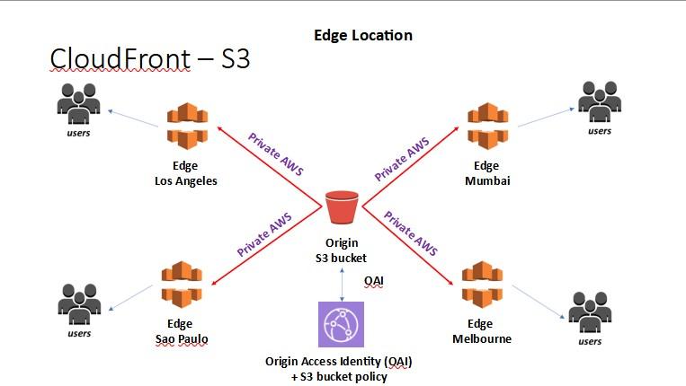

# Assignment 1 - Cloud Computing

# Site Link
### https://d3h0nnty80ji1q.cloudfront.net

___
# Architecture

# Amazon S3 - object storage service that stores data as objects within buckets
___

All assets are stored on an AWS S3 bucket from the html files that let you view the site to the awesome higlights of me slaying noobs in call of duty.

### Buckets are stored in a specific region 
in this specific bucket's case it is stored in the **US East (Ohio) us-east-2 region**.
Data uploaded to the bucket as objects in Amazon S3. Each object has a key (or key name), which is the unique identifier for the object within the bucket.

###  S3 Versioning
Set up to keep multiple versions of an object in the same bucket, which allows objects that are accidentally deleted or overwritten to be restored.

## Bucket Policy
### All public access is blocked to the s3 bucket

Only the bucket owner can associate a policy with a bucket. The permissions attached to the bucket apply to all of the objects in the bucket that are owned by the bucket owner.

### sample of s3 policy used 
Observe that an iam was used through cloud front, which is why the bucket and its objects are able to remain private. 

<pre><code>
{
    "Version": "2008-10-17",
    "Id": "PolicyForCloudFrontPrivateContent",
    "Statement": [
        {
            "Sid": "1",
            "Effect": "Allow",
            "Principal": {
                "AWS": "arn:aws:iam::cloudfront:user/CloudFront Origin Access Identity XXXXXXXXXXXX"
            },
            "Action": "s3:GetObject",
            "Resource": "arn:aws:s3:::cloud-computing-assign-1/*"
        }
    ]
}
</code></pre>

# Cloudfront
Enable accelerated, reliable and secure content delivery for Amazon S3 bucket using all edge locations. (best performance)
Allows use of Origin Access Identity (OAI) included in S3 bucket policy.

## High level overview

